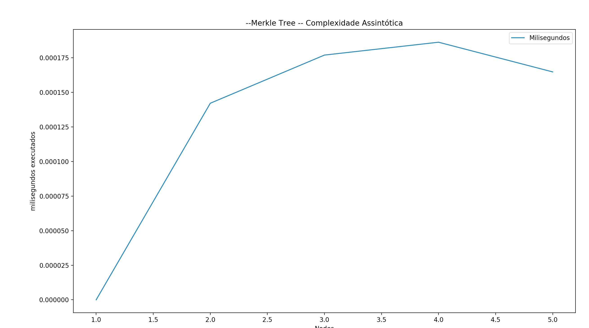
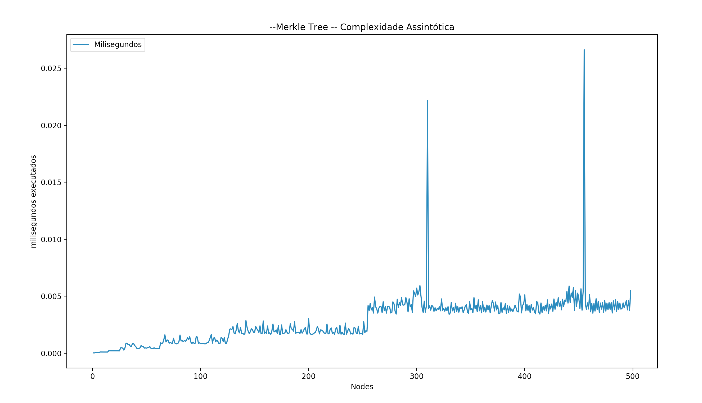

# Prova Merkle e Verificação

## Introdução

Árvore Merkle é uma estrutura de dados baseada em hash usada para provar a integridade de uma transação de dados armazenadados em blovo. **Para esse algoritmo assuma que as árvores são binárias, balanceadas, e que o número de transações serão armazenadas são algum expoente de dois.**

_Source: [Grid+](https://blog.gridplus.io/efficiently-bridging-evm-blockchains-8421504e9ced)_

Acima você poderá ver como a árvore se parece. As oito transações no bloco (A-H) estão alinhadas no campo transactions. O segundo campo contém 4 hashes (S(X) = sha3 hash) de transações filhas. O terceiro campo contém hashes de hashes filhos, e a raiz contém um hash de hashes de hashes das transações. Genericamente, isso é como parte da transação de bloco de Ethereum concentrado na raiz aonde nós conhecemos como transação header (uma das 15 peças de informação que vai no bloco header).

## O Problema

A razão de nós usarmos a árvore de Merkle para armazenar blocos de dados (i.e. transações) é que a verificação é muito eficiente. Essa verificação é chamada de prova de Merkle.

Suponha que nós provamos que a transação C foi de fato no bloco formado pelo header mostrado acima.

_Source: [Grid+](https://blog.gridplus.io/efficiently-bridging-evm-blockchains-8421504e9ced)_

Em adição a transação hash C , nós também precisamos de  D, S(A,B), e S(S(E,F),S(G,H)) para formar a prova. A verificação em si performa nos seguintes passos da forma:

* Hash C e D produzem S(C,D).
* Hash S(A,B) e S(C,D) produzem S(S(A,B),S(C,D)).
* Hash S(S(A,B),S(C,D)) e S(S(E,F),S(G,H)) produzem a raiz.
* Cheque que a raiz é o mesmo que foi armazenado previamente.

A eficiência aqui é que foi provado que a transação pertence a um bloco com 3 pedaços acomponhados de informação (ao invés de 7 outras transações que foram armazenadas no bloco). Essa eficiência se torna exponencialmente mais pronunciada em árvores grandes.

O trabalho implementa a funcionalidade da prova de Merkle sua verificação.

### Explicação das funções e layout do projeto

* `hash_data_structures.py`: contém classe com objeto intermediário que atua como nó na árvore.
* `merkle_tree.py`: contém implementação da árvore de Merkle; Pega uma lista de transações como inputs. Transações são geralmente em forma de strings nesse caso.
* `test_sanity.py`: testa o foco do uso básico para cada estrutura de dados
 `utils.py`: contém múltiplos métodos úteis ao desenvolvimento.
* `test.py`: script para ajudar a rodar outros testes.
* `test_*.py`: Testando roteiros construídos no módulo de unittest. Cada teste assegura a integridade do arquivo respectivo.

## Rodando Testes

Use `python3 test.py` roda todos os testes. Você pode adicionar os seus próprios testes e rodar dessa forma `python [filename].py`. Tenha certeza que o teste roda de acordo com o  `unittest` módulo .

## Complexidade assintótica

Foi feito um plot de complexidade assintótica para a execução de diversos testes da árvore de Merkle, dentre eles obtive o seguinte comportamento para 5 e 500 nós:

